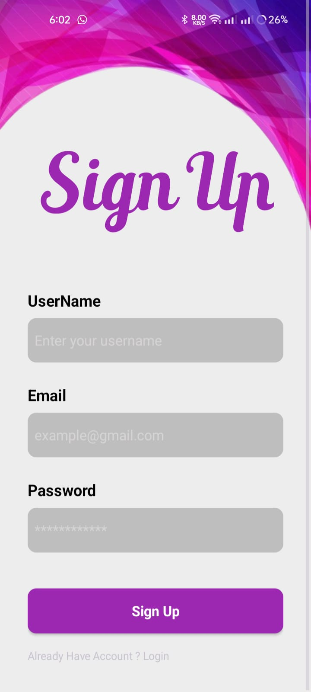
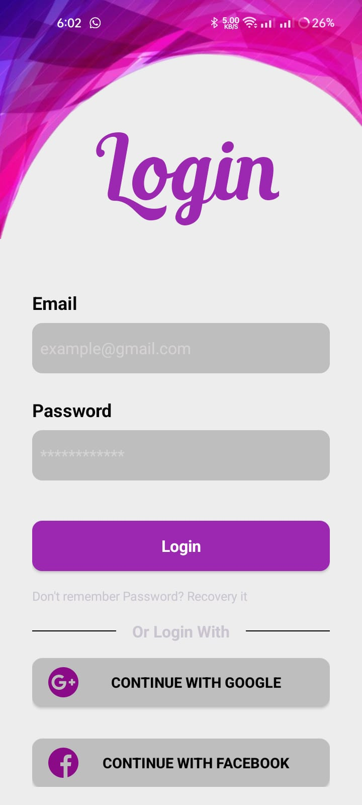
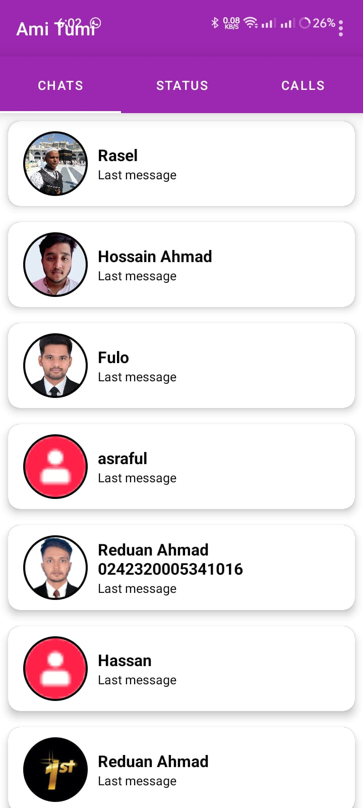

# 🚀 Chat App  

  
  

A **modern**, **lightweight**, and **secure** chat app for Android.  

## ✨ Features  
✅ Real-time messaging 🔥  
✅ Secure authentication 🔒  
✅ Push notifications 📢  


## 📸 Screenshots  

| SignUp Screen | Login Screen | Chat Page |  
|-------------|------------|--------------|  
|  |  |  |  

## ⚡ Installation  

1. **Clone the repository**  
   ```sh
   git clone https://github.com/ahmadreduan/Chat-App.git  
   ```
2. **Open in Android Studio**  
3. **Add Firebase Configuration**  
   - Place `google-services.json` in the `app` folder.  
4. **Run the app! 🚀**  

## 📚 Topics Covered  

### 🔹 Project Setup & Firebase Integration  
- Creating an Android project  
- Connecting Android Studio with Firebase  
- Firebase Authentication (Email & Google Sign-In)  
- Saving and retrieving user data from Firebase  
- Uploading profile pictures to Firebase Storage  

### 🔹 User Interface & Navigation  
- Sign Up & Sign In Activity layout design  
- ViewPager integration for main activity  
- Showing user list similar to WhatsApp  
- Implementing RecyclerView for chat users  

### 🔹 Chat & Messaging Features  
- Chat detail activity layout design  
- Sending & receiving messages in real-time  
- Designing chat bubbles (Sender & Receiver)  
- Implementing group chat functionality  

### 🔹 Advanced Features  
- Logout functionality  
- Showing last message in the user list  
- Updating user profile images dynamically  
- Handling errors and input validation  

### 🔹 App Deployment  
- Building and exporting APK in Android Studio  

## ⚙️ Technology Stack  

| Tech                | Purpose                   |  
|---------------------|-------------------------|  
| **Java**         | Programming Language     |  
| **Firebase Auth**  | User Authentication      |  
| **Firebase DB**    | Real-time Messaging      |  


## 🤝 Contributing  
Pull requests are welcome! If you want to contribute, feel free to open an issue first to discuss changes.  
